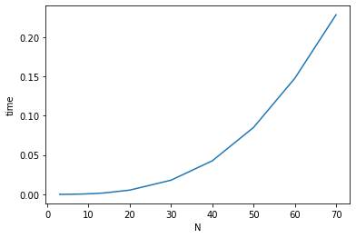

#### 二回目課題の説明です
# assignment1
 for文を使い三重ループのコードを書きました。
```
for i in range(n):
    for k in range(n):
        c[i,i] += a[i,k]*b[k,i]
    for j in range(i+1,n):
        for k in range(n):
           c[i,j] += a[i,k]*b[k,j]
           c[j,i] += a[j,k]*b[k,i]
```
最初実行の時に `python matrix.py`だけ書いて実行したら`usage: ./a.out N`という出力しか出なくて、sys.argvは**コマンドライン引数**と言って、コマンドラインで指定した引数のことであるの初めて知りました。
`python matrix.py 3`で入力したらN=3の場合の結果と時間の出力が出ました。

pythonでの実行結果が以下のようになります。

- N=3
```
time: 0.000026 sec
```
- N=4 
```
time: 0.000050 sec
```
- N=5
```
time: 0.000097 sec
```

| N | TIME |
|:--|:-:|
|3|0.000026 sec |
|4|0.000050 sec |
|5|0.000097 sec |
|6|0.000159 sec |
|7|0.000246 sec |
|8|0.000359 sec |
|9|0.000513 sec |
|10|0.000712 sec|
|11|0.000901 sec|
|12|0.001173 sec|
|13|0.001502 sec|
|14|0.001883 sec|
|20|0.005395 sec|
|30|0.017988 sec|
|40|0.042646 sec|
|50|0.085060 sec|
|60|0.147558 sec|
|70|0.228373 sec|


グラフにすると

 


以下のコードで実行したら結果がほぼ変わりませんでした。
```
for i in range(n):
    for j in range(n):
        for k in range(n):
           c[i,j] += a[i,k]*b[k,j]
```


ちなみに、C言語で実行した結果は以下になります
- code
```
  int l;
  for (i=0;i<n;i++){
    for(j=i;j<n;j++){
      for(l=0;l<n;l++){
        if(i!=j){
           c[i*n+j]+=a[i*n+l]*b[l*n+j];
        }
        c[j*n+i]+=a[j*n+l]*b[l*n+i];
      }
    }
  }
```
- N=3
```
time: 0.000001 sec
```
- N=20
```
time: 0.000048 sec
```
- N=50
```
time: 0.000562 sec
```

# assignment2
`現実の大規模なデータベースでは、ハッシュテーブルではなく木構造が使われることが多い。その理由を考えよ。`
- 　大規模なデータでハッシュテーブルを使うと必要となる容量が非常に大きくて非現実的である
- 　大規模なデータだとハッシュが衝突する可能性が大きくなって、一つのハッシュでたくさんのデータが並ぶ可能性があって、実行結果に影響するかもしれません
- 再ハッシュが使いたくても、データが多いと、予想外のことが起きがちで、何回か再ハッシュしても衝突が起きることが考えられる


# assignment3
- 双方向リストとハッシュテーブル合わせての構造でキャッシュを作ると計算量はo(1)になります

- key は URL, vlaue は (web page, older_url, newer_url) になる　辞書を考える
- 名前が　**new**,**old** である文字列変数を用意して、一番新しいurlと一番古いurlを記録する
- 与えられた<url, web page>=(**x**,y) について
* **x**というキーが存在するかチェックする
  * listが空の時
  　　 <br> new = x 
      <br> old = x
      <br> key='x',value(y,null,null) を辞書に追加する

  * 存在する時
    * new!=x の時
     1. xの前後の項目を繋ぐ
      <br>(old == x)old = x.newer_url
      <br>(old != x)x.older_url.newer_url = x.newer_url
      <br>x.newer_ur;.older_url = x.older_url

     2. xをnewにする
     <br>new.newer_url = x
     <br>x.older_url = new
     <br>x.new_url = null
     <br>new = x
    * new == xの時
    <br>何の処理もしない

  * 存在しない時
    * 辞書の長さがmaxになってる時
      1. 一番古いURLを辞書から消す
      <br> old = old.newer_url
      <br> key = old.older_urlである項目を辞書から削除
      <br> old.older_url = null

      2. 一番新しいURLをxにする
      <br>key='x',value(y,new,null)を辞書に追加する
      <br>new.newer_url = x
      <br>x.older_url = new
      <br>x.newer_url = new
      <br>new = x
    * 辞書の長さがまだmaxになってない時
      * xをnewにする
      <br>key='x',value(y,new,null)を辞書に追加する
      <br>new.newer_url = x
      <br>x.older_url = new
      <br>x.new_url = null
      <br>new = x

- その考え方だと問題点が出ました
長さがmaxになっているかどうかを確認するためには、どうすればいいでしょう
長さを求めるしか？　でも例のクラスだと最初の時点で長さが決めるから　nullと他のやつの数える方法か、最初からの辞書は長さ０にして、４を他の変数で記憶する（辞書の属性として記す？）

辞書の長さの計算の計算量はo(1)


# assignment4


tree hashmapの使い分け

